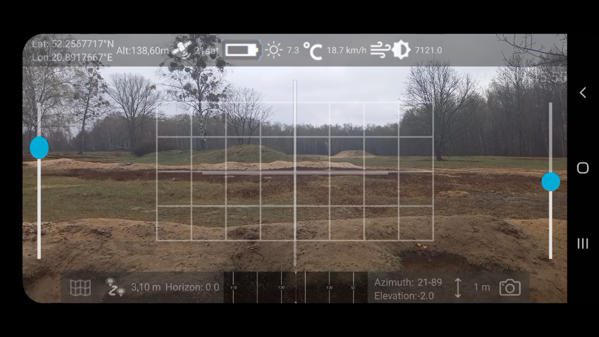

# ARAAFTOR - Augmented Reality Android Aplication for Tactical Object Recognition

ARAAFTOR is an extension designed for the ATAK application that supports situational awareness through the use of artificial intelligence mechanisms and sensor data. This implementation demonstrates the potential to enhance situational awareness on the battlefield and to support the command process by leveraging AI models and algorithms. Furthermore, it strives to be as relevant as possible to the dynamics of the modern battlefield.

## Features
- Utilization of TensorFlow Lite models for military object recognition in images.
- Real-time and photo-based object detection capabilities.
- Calculation of coordinates and distances to objects using the angular method.
- Advanced graphical user interface (GUI).
- Interactive map and compass functionality.
- History of all detected objects including name, time, and tactical symbol.
- Detailed panel with editable coordinates and distance displayed upon clicking a detection.
- Coordinate display available in multiple formats: decimal degrees, DMS, and DM.
- Editable list of bounding boxes in the image (class, position, confidence).
- Ability to add/remove bounding boxes and resize them.
- Reassignment of object classes and modification of detection confidence.
- Adjustable azimuth view (compass), affecting the location of the detection on the map.
- Tactical symbol editor assigned to each detection.
- Ability to change the unit size and type of tactical marking.
- Device instability handling: automatic capture of 3 images when motion is detected.
- Automatic selection of the best frame for detection.
- Intuitive resizing and repositioning of GUI elements (grid, map, image).
  
## Using ATAK for the first time
How to get started with ATAK extensions can be found [here](docs/first_time_in_ATAK.md).

## How to start
The procedure for running ARAAFTOR is described in [README](docs/how_to_run.md) file.

## Showcase
An example of using the ARAAFTOR extension can be found in [here](docs/showcase.md).

## Maintainers

Project maintainers are:

- Patryk Podbielski
